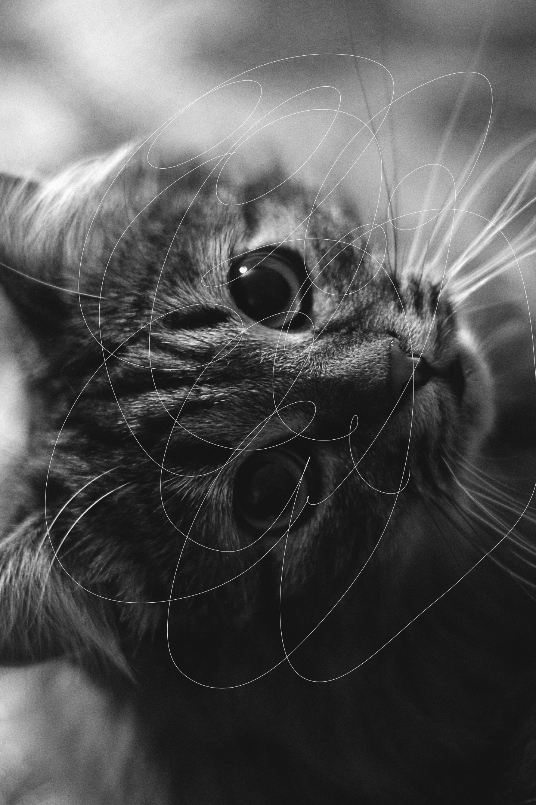

# 🎮 Image Processing Toolbox with Python

## 📌 Project Overview
This project is a **modular image processing toolbox** built with Python, designed to apply various image processing techniques such as filtering, edge detection, image enhancement, and inpainting. Using `NumPy`, `SciPy`, `Scikit-Image`, and `Matplotlib`, this project provides reusable functions for common image processing tasks.

## ✨ Features
✅ **Filtering** - Apply Gaussian & Median filters for noise reduction.  
✅ **Edge Detection** - Use Sobel & Laplacian filters for detecting edges in images.  
✅ **Image Enhancement** - Improve contrast & match histograms to reference images.  
✅ **Image Inpainting** - Restore damaged parts of an image using iterative smoothing.  
✅ **Modular & Extensible** - Functions are structured into separate modules, making it easy to extend functionality.  

## 🛠 Technologies Used
- **Programming Language:** Python
- **Libraries:** NumPy, SciPy, Matplotlib, Scikit-Image, Pillow (PIL)

## 🚀 Installation & Usage
### 🔧 1. Install Dependencies
Ensure you have Python installed (>=3.7), then run:
```bash
pip install -r requirements.txt
```

### 🖥 2. Run the Image Processing Tests
To process all available image processing tasks at once and save results, run:
```bash
python main.py
```
This will automatically execute:
- **Filtering:** Gaussian & Median filtering applied to sample images
- **Edge Detection:** Sobel-based edge detection
- **Image Inpainting:** Restoration of damaged images using iterative smoothing
- **Image Enhancement:** Histogram matching with a reference image

### 🎯 Running Individual Modules
If you want to test a specific image processing feature, you can run:
```bash
python src/filters.py        # Apply Gaussian & Median filtering
python src/edge_detection.py # Detect edges using Sobel filters
python src/inpainting.py     # Restore damaged images
python src/image_enhancement.py # Match histogram with a reference image
```
Each execution will generate output images in the `results/` directory.

## 📷 Example Results
### **1️⃣ Filtering Results**
| Original Image | Median Filter | Gaussian Filter |
|---------------|--------------|----------------|
|  |  |  |

### **2️⃣ Edge Detection Results**
| Original Image | Sobel X Gradient | Sobel Y Gradient | Gradient Magnitude |
|---------------|----------------|----------------|----------------|
|  |  |  |  |

### **3️⃣ Image Inpainting Results**
| Damaged Image | Restored Image |
|--------------|---------------|
|  |  |

### **4️⃣ Histogram Matching Results**
| Source Image | Reference Image | Matched Image |
|-------------|----------------|--------------|
|  |  |  |

## 📷 Image Credits
The images used in this project are from **Unsplash**, credited to their respective photographers:
- **Sample Image (`sample1.jpg`)**: [Dom Aguiar](https://unsplash.com/ko/@dom_aguiar)
- **Damaged Sample Image (`damaged_sample.jpg`)**: [John Morgan](https://unsplash.com/ko/@iamfrancismorgan)
- **Reference Image (`reference.jpg`)**: [FETHI BOUHAOUCHINE](https://unsplash.com/ko/@titouhwayne)

## 🛠 Future Improvements
- 👉 Implement more **advanced filtering** methods (e.g., bilateral filtering, non-local means).
- 👉 Add support for **color image processing**.
- 👉 Improve **performance optimization** for large-scale image datasets.

## 🐝 Author
Developed by **[Suyeon Kim]**. Feel free to reach out if you have any questions or suggestions!  
GitHub Profile(https://github.com/suyeonkim1010/Projects.git)  
LinkedIn Profile(https://www.linkedin.com/in/suyeon-kim-a43730256/) 