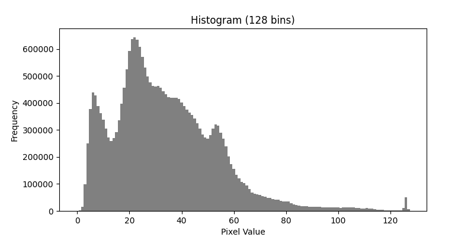
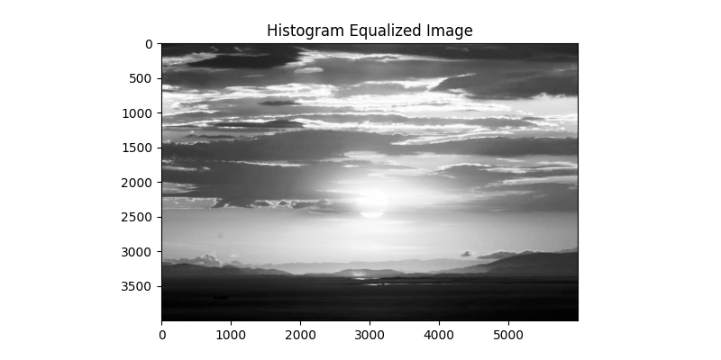
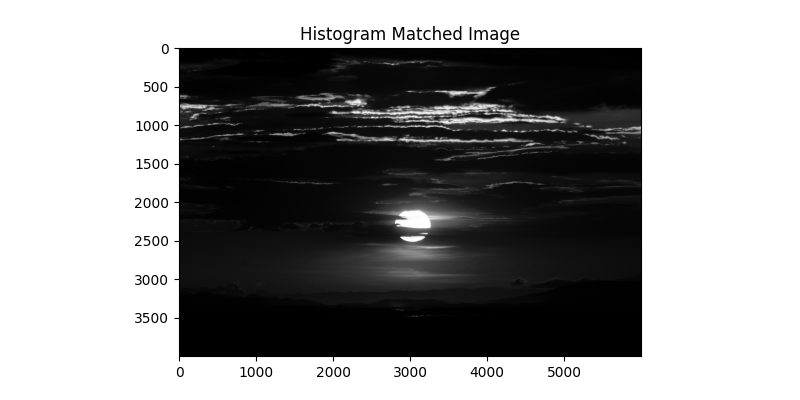

# Adaptive Image Histogram Processing for Enhanced Contrast and Matching

## Overview
This project explores advanced **histogram-based image processing techniques**, including **custom histogram computation, histogram equalization for contrast enhancement, and histogram matching for color transfer**. It works for both **grayscale and RGB images** and allows users to adjust image contrast dynamically or match the appearance of one image to another.

## ✨ Features
- **Custom Histogram Computation** - Calculates image histograms without using built-in functions like `np.histogram`.
- **Histogram Equalization** - Enhances image contrast by redistributing pixel intensities.
- **Histogram Matching** - Transfers the appearance of a reference image to another image.
- **Works for Grayscale & RGB Images** - Implements channel-wise processing for color images.
- **Efficient Implementation** - Uses NumPy-based optimized operations for fast processing.

## Technologies Used
- **Python**
- **Libraries:**
  - `NumPy`
  - `scikit-image`
  - `Matplotlib`
- **Version Control:** Git, GitHub
- **Documentation:** Markdown (README.md)
- **Dependency Management:** requirements.txt

## Installation
To run this project, first install the necessary dependencies:

```bash
pip install -r requirements.txt
```

## Usage
### 1️⃣ Compute Histogram
You can compute the histogram of an image **without using built-in functions**:

```python
from src.histogram_utils import compute_histogram_custom

# Compute histogram with 128 bins
compute_histogram_custom("images/sunset.jpg", n_bins=128)
```

### 2️⃣ Apply Histogram Equalization
Enhance the contrast of an image using histogram equalization:

```python
from src.equalization import enhance_image_contrast

# Apply histogram equalization
equalized_img = enhance_image_contrast("images/sunset.jpg")
```

### 3️⃣ Perform Histogram Matching
Match the histogram of one image to another:

```python
from src.matching import match_image_histogram

# Match the histogram of the sunset image to the city night image
matched_img = match_image_histogram("images/sunset.jpg", "images/city_night.jpg")
```

### 4️⃣ Run the Main Script
To process all images and visualize results, simply run:

```bash
python main.py
```

This will generate histograms, equalized images, and matched images based on the provided input.

## Example Results
### Histogram of the sunset image
| Original Image | Equalized Image |
|---------------|----------------|
|  |  |

### Histogram Equalization Example
| Original Image | Equalized Image |
|---------------|----------------|
|  |  |

### Histogram Matching Example
| Source Image | Reference Image | Matched Image |
|-------------|----------------|---------------|
|  |  |  |

## Image Credits
This project uses images from **Unsplash** under the [Unsplash License](https://unsplash.com/license), which allows free use for personal and commercial purposes with proper credit.

- **Sunset Image** 🌅  
  - 📸 [Jason Mavrommatis](https://unsplash.com/@jeisblack)  
  - 🔗 [View Image](https://unsplash.com/photos/GPPAjJicemU)  

- **City Night Image** 🌃  
  - 📸 [Takashi Watanabe](https://unsplash.com/@hasu_has)  
  - 🔗 [View Image](https://unsplash.com/photos/f2DL8oI-7N8)  
  
---

## 🐝 Author
Developed by **[Suyeon Kim]**. Feel free to reach out if you have any questions or suggestions!  
GitHub Profile(https://github.com/suyeonkim1010/Projects.git)  
LinkedIn Profile(https://www.linkedin.com/in/suyeon-kim-a43730256/) 

