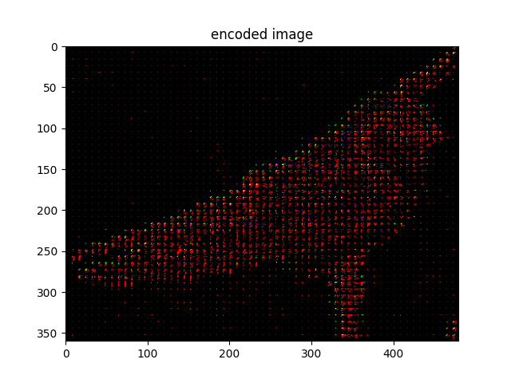
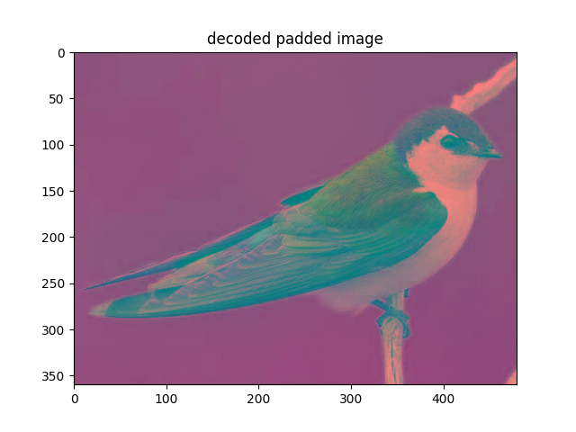
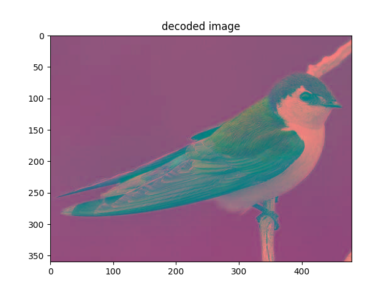

# 🖼️ JPEG Encoder & Decoder in Python

This project is a simplified implementation of the JPEG image compression and decompression pipeline using Python.  
It performs block-wise DCT, quantization, zig-zag scanning, and color space conversion (RGB ↔ YCbCr), mimicking the core steps of JPEG.

---

## 📦 Features

- Convert RGB images to YCbCr color space
- Perform 8x8 block-based 2D DCT and quantization
- Zigzag scan for coefficient reordering
- Inverse process for full image reconstruction
- Automatically saves visual outputs to `results/` folder
- Measures compression ratio using non-zero DCT coefficient counts

---

## 🧪 How It Works

1. **Encoding (`jpeg_encode`)**
   - RGB → YCbCr
   - Block-wise DCT + quantization
   - Zigzag reorder (saved but restored for demo)
   - Encoded image and compression info saved to:
     - `encoded.npy` — compressed image data
     - `size.txt` — original image shape info

2. **Decoding (`jpeg_decode`)**
   - Load from `encoded.npy`, `size.txt`
   - Reverse zigzag → dequantize → IDCT
   - YCbCr → RGB reconstruction

---

## 📁 Output Files

All output images are saved to the `results/` directory:
## 🖼️ Compression Results

| Step                | Image Preview |
|---------------------|----------------|
| Input RGB           | .png) |
| Input YCbCr         | .png) |
| Padded Input        |  |
| Encoded Image       |  |
| Decoded Padded YCbCr|  |
| Decoded YCbCr       |  |
| Final Decoded RGB   | .png) |


Also saved:
- `encoded.npy` – numpy array storing encoded image
- `size.txt` – shape metadata (original height, width, channels, block size)

---

## 🚀 Run

```bash
python jpeg_codec.py
```

Make sure `bird.jpg` is in the same directory.

---

## 🛠️ Requirements

- Python 3.x
- NumPy
- SciPy
- Matplotlib
- scikit-image

Install with:

```bash
pip install numpy scipy matplotlib scikit-image
```

---

## 🐝 Author
Developed by **[Suyeon Kim]**. Feel free to reach out if you have any questions or suggestions!  
GitHub Profile(https://github.com/suyeonkim1010/Projects.git)  
LinkedIn Profile(https://www.linkedin.com/in/suyeon-kim-a43730256/) 
