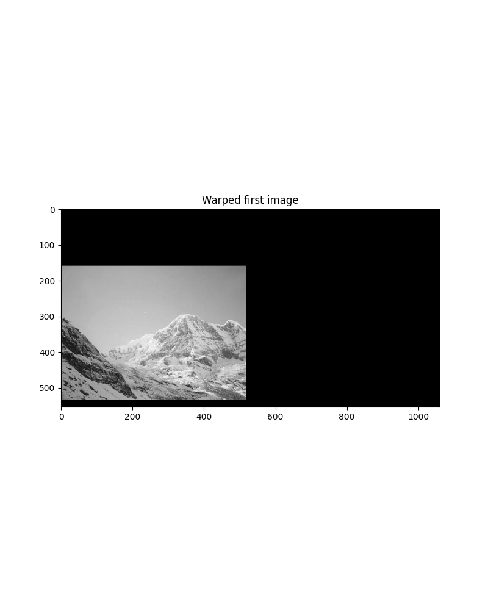

# Image Processing Showcase

This project is a rebranding of classic image processing tasks, divided into four core parts, showcasing different transformation and visualization techniques in Python using `skimage`, `numpy`, and `matplotlib`.

## 📁 Output Preview
All result images are saved in the `results/` directory automatically.

---

## 🧩 Part 1 - Bayer Pattern Interpolation
**Goal:** Reconstruct an RGB image from a Bayer-filtered grayscale input.

| Original Channel | Green Channel | Red Channel | Blue Channel | Final RGB |
|------------------|---------------|-------------|--------------|-----------|
| |  |  |  |  |

---

## 🎨 Part 2 - Dithering with a KMeans Palette
**Goal:** Reduce color complexity using a palette generated by KMeans clustering.

| Original Image | Dithered Image |
|----------------|----------------|
|  |  |

---

## 🔄 Part 3 - Geometric Transformations
**Goal:** Apply rotation, scaling, and skew transformations and visualize the combination.

| Original | Rotated Image | Scaled Image | Skewed Image | Combined Warp Image | Combined Warp Image with Bilinear Interpolation |
|----------|---------------|--------------|--------------|---------------------|-------------------------------------------------|
|  |  |  |  |  |  |

---

## 🧵 Part 4 - Panorama Stitching
**Goal:** Align and merge two overlapping images using local features.

| Before Img1 | Before Img2 | Warped Img1 | Warped Img2 | Merged Panorama | Inlier Matches |
|-------------|-------------|-------------|-------------|-----------------|----------------|
| |  |  |  | | 

---

## 🚀 How to Run
Make sure to install the dependencies first:
```bash
pip install numpy matplotlib scikit-image scipy scikit-learn
```
Then, run the main script:
```bash
python A3_student.py
```
All output images will be saved to the `results/` folder.

---

## 📌 Notes
- Randomized processes (e.g., KMeans, RANSAC) may slightly vary on each run.
- All outputs are scaled and saved as `.png` for consistency.

---

Enjoy the visuals and pixel magic! ✨