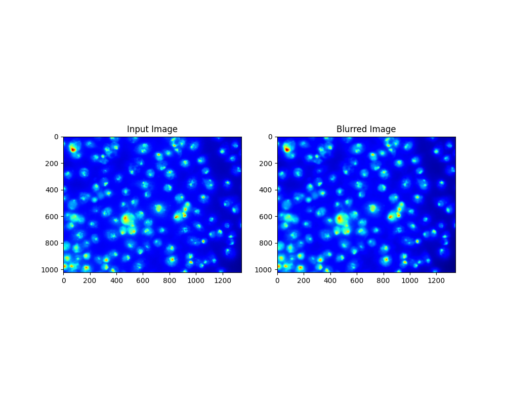
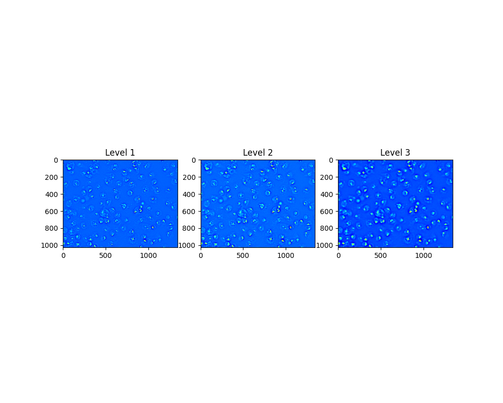
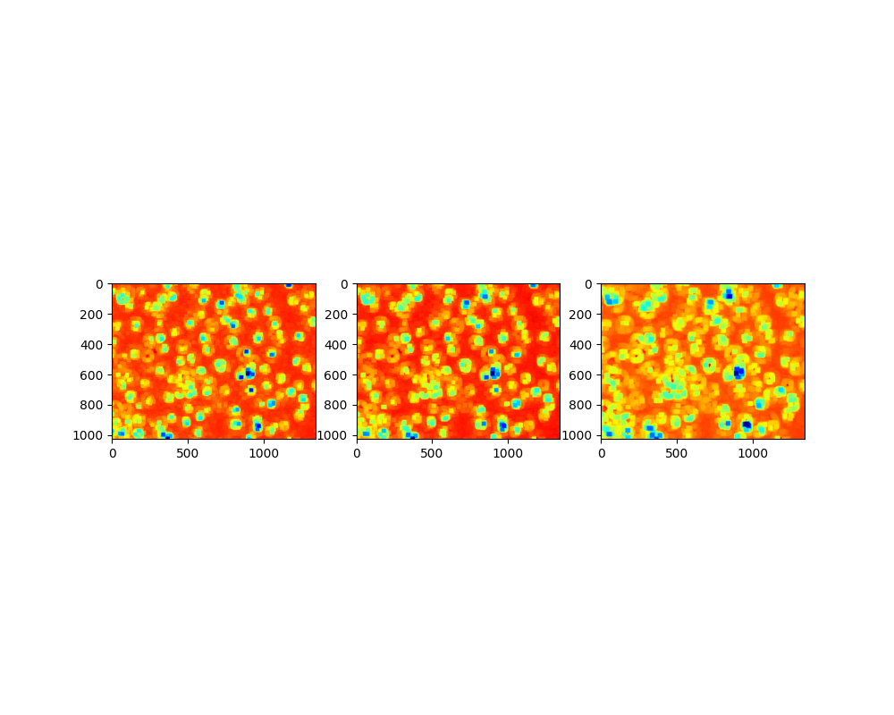
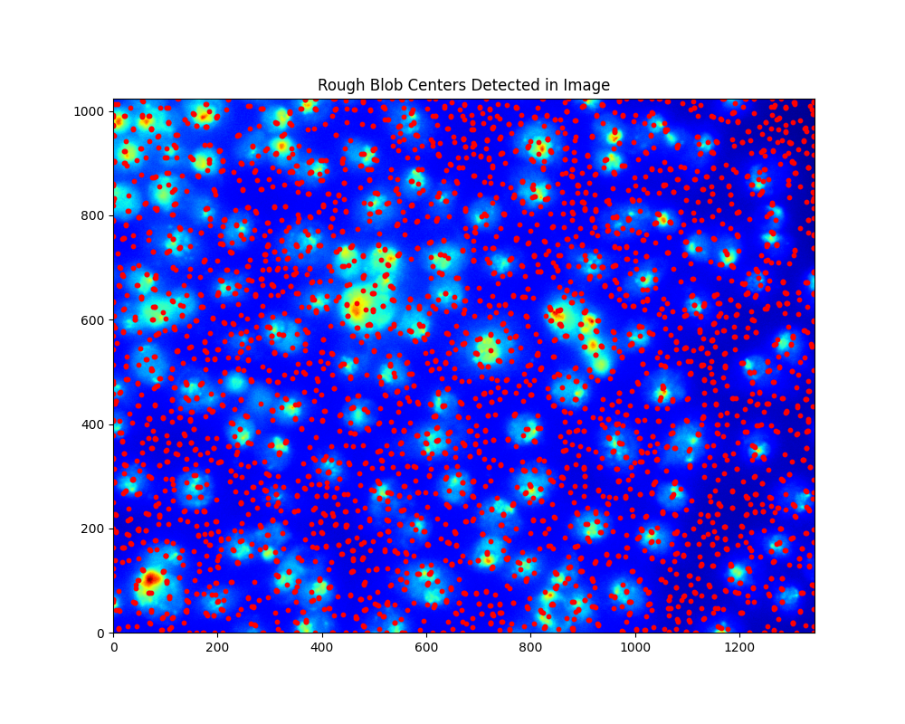
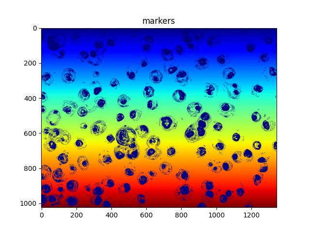
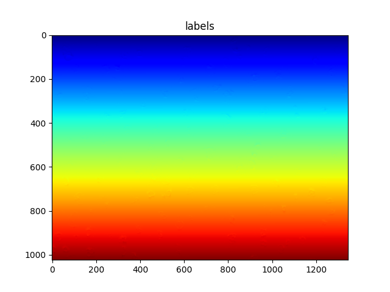
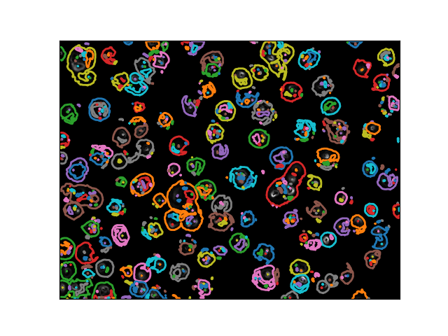

# 🧬 Cell Segmentation using Blob Detection and Watershed

This project performs automatic cell segmentation using Difference of Gaussian (DoG) blob detection and a watershed-based segmentation approach. The goal is to detect cell nuclei and segment their boundaries from microscopy images.

---

## 📌 Features

- Difference of Gaussian (DoG) for detecting blob-like structures (e.g., cell nuclei)
- Li's thresholding for refining detections
- Watershed segmentation with 4-connected regional minima labeling
- Intermediate and final result visualization saved in `results/` folder

---

## 🛠 How It Works

### Step 1: Blob Detection
- Applies Gaussian filtering with multiple scales
- Computes 3 DoG levels to enhance blob features
- Detects regional minima (potential blob centers)
- Refines detections using Li thresholding

### Step 2: Watershed Segmentation
- Computes image gradient magnitude from a blurred version of the image
- Applies `imimposemin()` to guide watershed segmentation
- Labels regions using an iterative minimum-following algorithm

---

## 📁 File Structure

```
.
├── cell_segmentation.py       # Core detection and segmentation functions
├── main.py                    # Pipeline runner (calls all steps)
├── nuclei.png                 # Input microscopy image
├── test_image.txt             # Simple matrix for debugging
├── results/                   # All output images saved here
│   ├── Input+Blurred.png
│   ├── Level123.png
│   ├── local minima.png
│   ├── Rough_Blob_Centers_Detected.png
│   ├── Refined_blob_centers_detected.png
│   ├── markers.png
│   ├── labels.png
│   └── cells.png
```

---

## 🚀 How to Run

Install the required packages:

```bash
pip install numpy matplotlib scikit-image opencv-python
```

Run the pipeline:

```bash
python main.py
```

All intermediate and final results will be saved in the `results/` folder.

---

## 📷 Example Results

### 1. Input Image and Blurred Result  


### 2. Difference of Gaussian Levels  


### 3. Local Minima Detected  


### 4. Rough Blob Centers Detected  


### 5. Refined Blob Centers (Li Thresholding)  


### 6. Watershed Markers  


### 7. Final Region Labels  


### 8. Final Cell Segmentation  


---

## 🐝 Author
Developed by **[Suyeon Kim]**. Feel free to reach out if you have any questions or suggestions!  
GitHub Profile(https://github.com/suyeonkim1010/Projects.git)  
LinkedIn Profile(https://www.linkedin.com/in/suyeon-kim-a43730256/) 